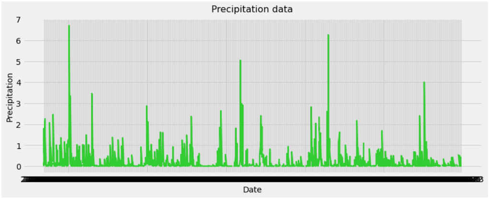

# SQLAlchemy - Surfs Up!

I've decided to treat myself to a long holiday vacation in Honolulu, Hawaii! To help with my trip planning, I needed to do some climate analysis on the area.

To begin, I used Python and SQLAlchemy to do basic climate analysis and data exploration of my climate database. All of the following analysis was completed using SQLAlchemy ORM queries, Pandas, and Matplotlib.

### Precipitation Analysis

* Plot with the results using the DataFrame `plot` method.

    

### Station Analysis

* Plot with the results as a histogram with `bins=12`.

    

- - -

## Climate App

Now that I have completed my initial analysis and I designed a Flask API based on the queries that I have just developed.

* I Used Flask to create my routes.
